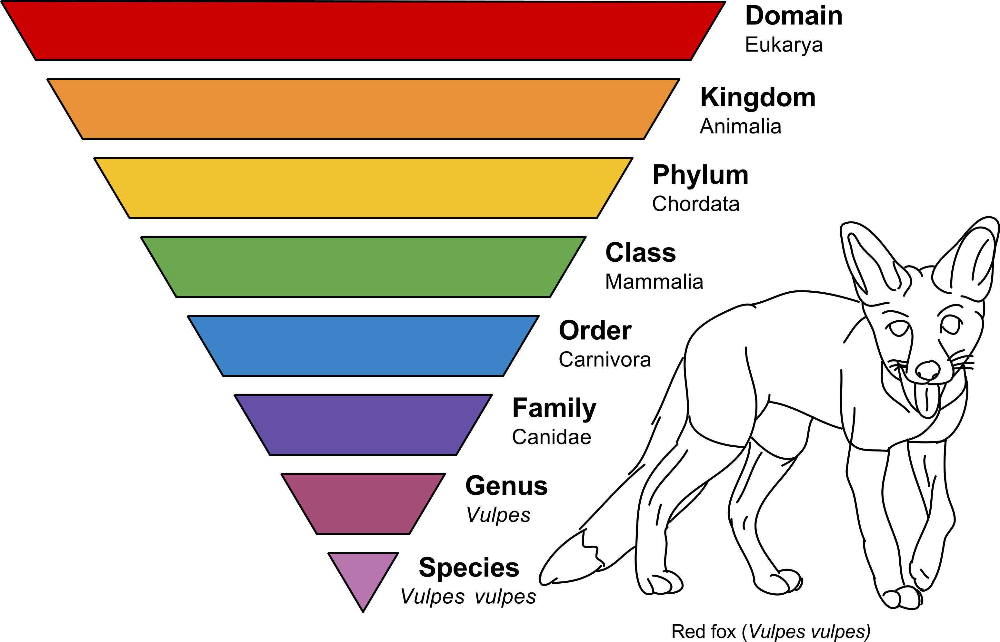

```{r setup, include=FALSE}
knitr::opts_chunk$set(echo = TRUE, fig.height = 6,
                      fig.width = 9, warning = F)
```
# Objective

The aim of this tutorial is to give you a brief insight into *one* possible way to approach a dataset of microbiome amplicon data. 

The dataset you will be working with is a dataset of 16S rRNA V1-V2 amplicon data from human fecal samples. We want to inspect differences in different traits. The attached metadata for our samples contain the traits biological sex and whether the samples are form healthy people (Control - CNTRL) or people with inflammatory bowel disease (IBD). 

In this tutorial we show you how to inspect the microbiome on the basis of biological sex. Ultimately, you will be able to answer if the microbiome of people with IBD is different from the microbiome of healthy people.

# Set work directory

# Use the path that your folder scripts are on.

You should have this file you are reading right now open in your RStudio application. With the command `getwd()` you can check what working directory you are in. It should look something like below and please make sure you are in the "scripts" folder. If you are not, you can used the `setwd()` command to set the correct working directory.

```{r}
getwd()
# "~/Desktop/microbiome/Microbiome.tutorial.2022-main/scripts"
#setwd("~/Desktop/microbiome/Microbiome.tutorial.2022-main/scripts")
```

# Load necessary libraries

For the tutorial, we will be using several packages for R which you should have installed prior to this course using the provided instructions. If not, please quickly do so.

The packages are:
* tidyverse: [Tidyverse](https://www.tidyverse.org/) is a collection of multiple packages for data sciences which help writing cleaner code, smarter conversions of data structures and beautiful plot. If you are planning to work with microbiome data in the future, it makes a lot of sense to get a deeper look into tidyverse
* phyloseq: the phyloseq package is specifically designed for microbiome data and their analysis in R
* vegan: vegan provides many important functions for numerical ecology
* microbiome: another package with useful functions for microbiome analysis
* DESeq2: DESeq2 is a framework designed for the analysis of differential expression analysis of RNASeq data. RNASeq data and microbiome amplicon data share many properties regarding their general structure, which enables us to repurpose DESeq2 for the analysis of microbiome data.

```{r, message = F}
library(tidyverse) 
library(phyloseq)
library(vegan) 
library(microbiome) 
library(DESeq2) 
```

# Import and format the data

The dataset we are using today was pre-processed using [DADA2](https://benjjneb.github.io/dada2/tutorial.html). For this tutorial, we decided to not include the dataprocessing itself and rather focus on hands-on microbiome data analysis. However, in the `data_processing.Rmd` script you can find all details on how the data was processed as reference for your own future data processing tasks.

## Import ASV table

DADA2 output are clean Amplicon Sequence Variants (ASVs; sometimes also called Ribosomal Sequence Variants/RSVs or zero OTUs/zOTUs), which means, it tries infer the exact amplicon sequence from the Illumina sequencing reads. The idea of using exact sequences is still rather new, as only a few years back (and actually still performed) sequencing quality was less reliable than it is today and computers were less powerful, but also databases of bacterial 16S rRNA sequences were much smaller, leading to the assumption, that clustering the less accurate sequencing data into so-called Operational Taxonomic Units (OTUs) at a universal level of 97\% similartiy will create community summaries of bacterial species. However, the growing database of microbial genomes and advances in data processing could clearly show, that this level of clustering is not sufficient, but that single nucleotide resolution is necessary (see [Edgar 2018](https://pubmed.ncbi.nlm.nih.gov/29506021/)). Together with increasing computational power and the development of new algorithms, this has now become the new standard in amplicon-based microbiome analysis.

Let's import the microbiome data. We will call it micro.

```{r}
path <-  "../data_processed/"
micro <-
  readRDS(paste0(path, "seqtab.Rds"))
head(micro[1:4,1:2])
```

As you can see, this matrix consists of one row for each sample and one column for each ASV sequence. The values in the matrix are the number of occurences (counts) of a specific ASV sequence in a sample.

## Import tax information

After the inference of the ASV sequences, we can assign taxonomic labels to get insights into which ASV(s) represent which bacteria. For this we use taxonomic reference databases. Multiple of these database exist (e.g. [RDP](http://rdp.cme.msu.edu/), [SILVA](https://www.arb-silva.de/), and [GTDB](https://gtdb.ecogenomic.org/)), all of them have strengths and weaknesses and are constantly updated, growing together with newly discovered and sequenced microorganisms. However, independent of the used database, the annotation of 16S rRNA gene nucleotide sequences can be challenging and does not perform equally for all microbes, though usually genus-level annotation is possible for most sequences, thus this tutorial will focus mainly on this level (more information on this comes later in the tutorial). 

The taxonomic information has alrady been inferred for our samples using the `data_processing.Rmd` script, so we can now simply import that information:

```{r}
tax <-
  read.delim(paste0(path,"tax_tables.tsv"), sep = "\t") 
head(tax,1)
```

Looks alright. Note that for this data frame, the row name (which itself is not a column of the data table - it does not have a header name) is the ASV sequences.

Each ASV represents a column of the ASV table. Is it the same order as in the taxonomy table?

```{r}
identical(tax %>% rownames(), micro %>% colnames()) # This is the same as identical(rownames(tax), colnames(micro))
```

>Note: Here I we are using `%>%` ([pipe](https://cran.r-project.org/web/packages/magrittr/vignettes/magrittr.html)) from the magrittr package which is part of the tidyverse. It is much easier to code with it. "(With it, you) ... may pipe a value forward into an expression or function call; something along the lines of **x %>% f**, rather than **f(x)**." You will see the pipe 

## Import sample information

Next, we need information on the samples we got the data from:

```{r}
samples <-
  read_tsv(paste0(path,"samples.txt"), col_names = F)
head(samples)
```
As we can see, we have 4 columns. X1 is for the library ID, X2 is the condition, X3 is for the sample ID and X4 is for the biological sex. Let's rename the columns.
```{r}
colnames(samples) <-
  c("ID", "Condition", "Sample", "Sex")
head(samples)
```

Now, is the sample order in the ASV table the same as in the samples table?

```{r}
identical(micro %>% rownames(), samples %>% pull(Sample))
```
It is!

# Make phyloseq object

Now, we need to combine the 3 data frames into a single object from the package [phyloseq](https://joey711.github.io/phyloseq/). This is a a S4 object. The idea is that it bundles this data set and format it in a way that makes it easier to work with them.

```{r}
# Prepare data

tax.ps <-
  tax_table(tax %>% as.matrix())

micro.ps <-
  otu_table(micro, taxa_are_rows = F)

samples.ps <-
  sample_data(samples %>% data.frame())

rownames(samples.ps) <- samples.ps$ID

# Combine data into a single object

ps <-
  phyloseq(tax_table(tax.ps),  
           otu_table(micro.ps, taxa_are_rows = F),
           sample_data(samples.ps)
           #sample_names(samples.ps)
           )


```

## The phyloseq object

```{r}
ps
```

>**TASK**
Try to use the functions **otu_table()**, **sample_data()** and **tax_table()** to access different components of the phyloseq object

# Analysis

## How much did we sequence of each sample?

```{r}
counts <-
  ps %>% 
  otu_table() %>%
  data.frame() %>% 
  rowSums()
counts
```

To have it a bit nicer, let's use pipes and ggplot2 to visualize this

```{r}
to.plot <-
  counts %>% 
  data.frame(counts = ., Sample = names(.))

ggplot(to.plot, aes(x = Sample, y = counts)) +
  geom_col() +
  geom_hline(yintercept = 10000) + # add horizontal line 
  theme(axis.text.x = element_text(angle = 90, vjust = 0.5, hjust=1)) # flip the axis names

```

> **Tip**
To understand better what is going on, try to run each line removing the "%>%"   


**What do you say about the number of sequences? Did we sequence enough?**

## Alpha diversity

Alpha diversity is the diversity of a single ecological community - in our case, a microbiome sample. 

### Visualization

Phyloseq offers a function to plot several alpha diversity metrics. Let's use it.

```{r}
plot_richness(ps) 
```

First, you will notice that there are many ways to **understand** alpha diversity. Each metric offers one perspective of it. Some represent **richness** (observed ASVs, Chao1, ACE), others interpret alpha diversity also taking into account the **evenness** (e.g. Shannon and Simpson).


Looking at data like that, it does not tell us much about our main question: **Is there a difference between the biological sex of the samples?** Let's see what the function does, so we can improve our visualization.

```{r}
?plot_richness
```

We can see that the function uses another function estimate richness, which we will use to make a graph bit fancier, with just one metric: **Shannon**.

```{r}
rich <-
  ps %>% 
  rarefy_even_depth() %>% # let's rarefy the data to make sure that sequencing depth is similar for all samples
  estimate_richness(measures = "Shannon") %>% # get alpha diversity
  rownames_to_column("Sample") %>% #format
  left_join(sample_data(ps) %>% data.frame(), by = "Sample") # here I am combining the output of estimate richness with the sample data of the phyloseq object. I need to transform it to data.frame first

# Check output
rich %>% head()

#Fancy plot
ggplot(rich, aes(x = Sex, y = Shannon)) +
  geom_boxplot() +
  geom_jitter()

```

>**TIP/TASK**
Look at this [page](http://www.sthda.com/english/wiki/ggplot2-colors-how-to-change-colors-automatically-and-manually) and see if you can change the color of the points or boxplots. 


>**Caution note**: There is a lof of discussion in the field about whether rarefaction is the best transformation method to account for different sequencing depth. For simplicity, I included it here just to remind you that you have to control for it somehow. For further discussion, you can dig into this [paper](https://journals.plos.org/ploscompbiol/article?id=10.1371/journal.pcbi.1003531) from the authors of phyloseq on the theme.

**But, is this significant?**

### Statiscal testing

Let's apply the non-parametric Wilcoxon rank sum test to see if the groups' mean ranks differ.

```{r}
rich %>% 
  arrange(Sex) %>% 
  wilcox.test(Shannon ~ Sex, data = .)
```


**So, what you can tell about the effect of biological sex on diversity?**

## Beta diversity

Beta diversity is the measure of diversity between two ecological communities.

### Visualization

A way to visualize beta-diversity (distance/similarity/**dissimilarity**) between microbiome samples is to reduce data into few, preferably two, dimensions. Such a technique, used mainly for data exploration, is called ordination. In the ordination, each sample is represented by a point (or other shape) - the distance between two points in the plot is an approximation of the "real" distance between the communities. Phyloseq has two functions that are very useful to perform and visualize ordination. Let's use them to calculate **Bray-Curtis** dissimilarities between samples and then use **non-metric multidimensional scaling** to ordinate the dissimilarities.


```{r}
ps.ord <-
  ps %>% 
  rarefy_even_depth() %>% # let's rarefy the data to make sure that sequencing depth is similar for all samples
  ordinate("NMDS", "bray")
p1 = plot_ordination(ps, ps.ord, type="samples", color="Sex")
print(p1)
```


What do you see?

> **TASK**
Check the different way/metrics to ordinate and plot them, and see if the results changes. To check what is on the menu type: *?ordinate()* for checking different ordinations and *?distance()* for checking different distances"


**But is this significant?**

### Statistical testing

To test whether the centroids (Location) and dispersion varies between groups, we will use **PERMANOVA** (Permutational Multivariate Analysis of Variance Using Distance Matrices). This approach basically looks if the points assigned to different groups are more similar to another, than they are to the points of the other group. Additionally, it uses random permutations of the data to check if this is also true when the samples are assigned to clusters randomly. By doing this many times, the test assigns a kind of P-Value (actually an F-Score) to the result, indicating how many times the random assignment into groups fitted better than the original clusters.

```{r}
micro.dis <-
  ps %>% 
  rarefy_even_depth() %>% # let's rarefy the data to make sure that sequencing depth is similar for all samples
  phyloseq::distance("bray")

adonis(micro.dis ~ Sex, data = ps %>% sample_data() %>% data.frame())
```


**What you can tell me about the effect of biological sex on diversity? What does it mean to observe a difference in beta diversity in comparison with alpha diversity?**


## Taxonomy

Here, we are going to look at the microbiome at the taxonomical perspective. To remember: we produced amplicon variant sequences (ASVs) using DADA2 and these were classified into different taxonomic levels.



Taoxnomic levels. Author: Annina Breen.

The assignment of taxonomic labels to the final ASV sequences is an important step, as these information can help make sense of the results for example by knowing that specific bacteria can perform specific metabolic functions. Also, taxonomic labels help to bin sequences together into larger phylogenetically related groups (meaning: groups that have a common ancestor at a given level of similarity), for example belonging to the same bacterial Phylum (very broad), Family (kind of similar), or even species or strain (very similar; many functions/genes are shared). As already mentioned, databases are still growing and newly discovered bacteria are constantly added to them, especially now as large-scale sequencing is widely available. This makes it especially hard to keep them up to date. Luckily, today we are working with samples from human stool samples, an environment which is widely studied and thus key members of the community are rather well-known and described.  

So, lets have a look at the taxonomic composition of the stool microbiome

### Visualization

Phyloseq offers a function to plot the taxonomic composition. 

```{r}
plot_bar(ps, x="Sample", fill="Phylum") +
  facet_wrap(~ Sex, scales = "free") # divide the plot into two facets 
```

We see that samples have different sequence counts. Each ASV is a subdivision of the plot. Can you already spot phyla that differ between the two groups?

**How can we improve here?**

```{r}
ps %>% aggregate_taxa(level = "Phylum") %>% # aggregate all ASVs into the level phyloum
  rarefy_even_depth() %>% # make all samples with the same sequencing depth using rarefaction
  plot_bar(x="Sample", fill="Phylum") + 
  facet_wrap(~ Sex, scales = "free")
```

Better, right? How about now, do you see differences between FEMALE and MALE?

As you can see from the figure with the fox, the phylum-level is a rather broad group when it comes to taxonomic classifications (nevertheless, also distantly related genera or species within a phylum can share lots of properties). Let's have a more in-depth look at the data on the genus level: 

```{r}
#Original function was deprecated. So we keep a backup here:
aggregate_top_taxa2 <- function(x, top, level) {
  x <- aggregate_taxa(x, level)

  tops <- top_taxa(x, top)
  tax <- tax_table(x)

  inds <- which(!rownames(tax) %in% tops)

  tax[inds, level] <- "Other"

  tax_table(x) <- tax

  tt <- tax_table(x)[, level]
  tax_table(x) <- tax_table(tt)

  aggregate_taxa(x, level)
}

ps %>% aggregate_top_taxa2(top = 10, level = "Genus") %>% # Here we used the function from the package microbiome to reduce the number of taxa to the top 10. The rest is lumped into the category "other"
  rarefy_even_depth() %>% 
  plot_bar(x="Sample", fill="Genus") +
  facet_wrap(~ Sex, scales = "free") + 
  scale_fill_brewer(palette="Paired") # change colors of bars
```

>**TASK**
Try with other levels. If you do know which levels there are: check  the columns of tax_table(ps)@.Data using the function colnames()

It's possible that we can actually identify differences between the groups also on genus level "by eye".

**But is this significant?**

### Statistical testing 

We will use DESeq2 package to apply a **generalized linear model with negative binomial distribution** to the bacterial abundances - in our case here, on the genus level. Within DESeq2, we will apply **Wald test** to see whether the abundance of genera differs between the groups control and IBD. DESeq2 includes a internal calculation for library size to account for different sequencing depths and also performs P value adjustments for multiple tests.

First, we need to format the data by combining all ASV counts into the genus level.

```{r}
ps.to.dseq <-
  ps %>%
  aggregate_taxa(level = "Genus")
```

Now, let us do the DESeq2 routine

```{r}

# Create DESeq2 object from 
dseq <-
  ps.to.dseq %>% 
  phyloseq_to_deseq2(design = ~ Sex)

# Perform test. There is a lot going under the hood here, including: estimation of size factors, estimation of dispersion, and Negative Binomial GLM fitting and Wald statistics.
res <-
  DESeq(dseq)

res %>% colData %>% head()

# Extract the result table
res.df <-
  res %>% 
  results(tidy = T)

#Visualize what we got out of it
res.df %>% head()
```

That's it! You can have a look at the `res.df` table and you will find the results of all the genus tested. Depending on your question, you can perform similar analysis to all levels, from phylum to ASV (species level). 

So, to finish, let's format this table and visualize the data using ggplot2.

```{r}
# Filter and format to plot
res.df.to.plot <-
  res.df %>% 
  filter(padj < 0.05) %>% # keep only results with adjusted P value less than 0.05
  mutate(Genus = row) %>% # Create Genus column
  left_join(tax_table(ps.to.dseq )@.Data %>% data.frame(), by = "Genus") %>% # Add taxonomy information from the phyloseq object.
  # Arrange the data for a prettier plot
  arrange(log2FoldChange) %>% 
  mutate(Genus = factor(Genus, levels = Genus %>% unique()))

head(res.df.to.plot)


#Plot

ggplot(res.df.to.plot, aes(x = log2FoldChange, y = Genus)) +
  geom_jitter(aes(col = Phylum, size = baseMean))  +
  geom_vline(xintercept = 0)
```

# Analysis of IBD patients in comparison to controls

We showed you how to perform a 16S Analysis by the means of alpha and beta diversity and differential abundance. You probably saw that there is not much difference in the analysed trait. But, we expect a difference by the fact that some are suffering from IBD. <br /> 
**Your task is now to apply the script above to the 'Condition' trait.**

Please answer the following questions: <br />

* Is there a significant difference in alpha diversity between IBD patients and controls?
* If so, which bacteria are driving the low diversity and such a different community composition?
* What does it mean to have a less diverse microbiome?
* Are there differential abundant genera?
<br />

# Session information
```{r}
sessionInfo()
```